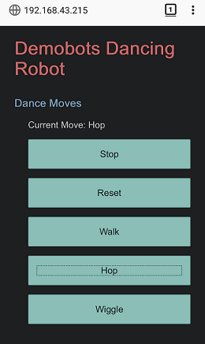

# THIS CODE HAS BEEN DEPRECATED AS WE HAVE MOVED TO ESP32 FOR DEVELOPMENT

## Oscillator
Wrapper for Servo class that inputs sinusoidal oscillation parameters instead of a position. Periodically samples the desired sine wave to update the position of the servo.

## DancingServos
Wrapper for four Oscillators, representing a set of legs comprised of four servos. Contains a function that passes sinusoid parameters to each of the four Oscillators. A dance move calls this function with different sine waves on each motor.

## Microcontrollers
### Teensy 2.0++
Arduino IDE with Teensyduino. Powered controller and servos with 4 AA batteries.
### TI LaunchPad
Energia with Drivers for LaunchPad. Use a 5v regulator when powering the LaunchPad. Also working on a version based on Rasware.
### ESP32 Dev Board
ESP32 WiFi Microcontroller, with web page controller for selecting dance moves, programmed with Arduino IDE. Updated DancingServos class to allow the web server to run at the same time. Added dance routine buttons, which activate a loop of multiple dance moves.

