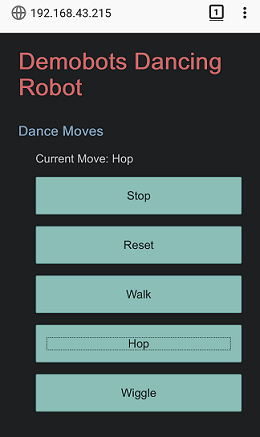
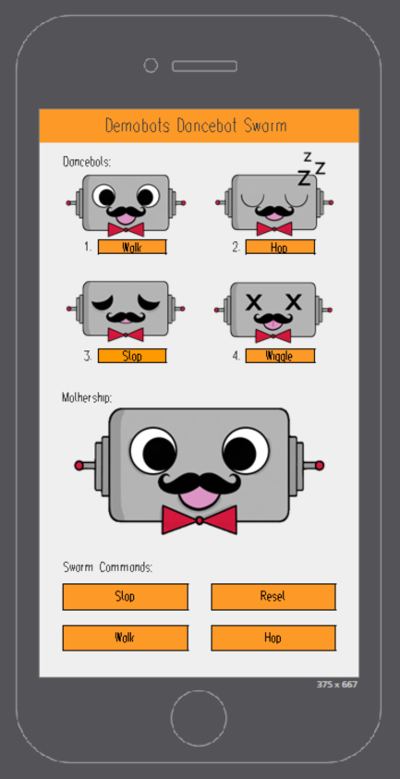

# Dancebot

Hello there! Dancebot is a remote controlled platform of dancing robots, geared
for student outreach. This robot, now in the second generation, is designed by
the noncompetitive Demobots arm of IEEE RAS.

---

## Version 1.x.x

Version 1 of the Dancebot project was developed under the leadership of Cole
Thompson, the former Demobots committee head. It features a simple but clean
webpage user interface, allowing students and users to command a 3D printed
robot to move and dance.

The dancebot operates on a set of four servos; one commanding each ankle and
another commanding each leg. This configuration allows the Dancebot to make a
variety of movements, like hopping, walking, and wiggling!

---

## Version 2.0.0

Version 2 of the Dancebot introduces a new of set of functionality meant to make
it more interactable and interesting for our users. This version of the Dancebot
enables swarm functionality, allowing a group of Dancebots to move in tandem
with each other. In particular, we've added the following features:

- A new, slimmed down mechanical design of the Dancebot, making it lighter and
  easier to take with you on the go.
- Additional hardware support, including:
  - LED eyes made from the [NeoPixel
    Jewels](https://www.adafruit.com/product/2226), allowing the Dancebot to
    emote with their eyes.
  - A battery status circuit, enabling early indication of robot state of charge.
  - A shutdown circuit, which allows users and the robot to remotely or
    automatically turn off the robot on demand.
  - A custom printed circuit board (PCB), optimizing the internal capacity of
    the robot and allowing space for a larger battery.
- A large software rewrite, with a new system architecture allowing each Demobot
  robot to run on a collective Demobot network- all at the same time.
- And revamped web user interface, with more options and indicators on robot
  health.

This project is in conjunction with our larger Demobots Mothership, a revamped
Region V committee robot designed to house the Dancebot swarm and act as a
central communication node for the swarm.

This project was led by the following RAS members:

- Ian Krause and Reiko Corteza (Mechanical development)
- Ahmad Ahbab (Web design and network communication)
- Matthew Yu (Electrical and firmware development)

---

# Development

Do you want to contribute to Dancebot or make your own? Send in a PR or fork the
repo! Send us a message at [RAS](https://ras.ece.utexas.edu/index.html) if
you're interested in getting involved.

Installation and setup instructions can be found in
[DEVELOPMENT.md](DEVELOPMENT.md).
### ESP32 Dev Board
ESP32 WiFi Microcontroller, with web page controller for selecting dance moves, programmed with Arduino IDE. Updated DancingServos class to allow the web server to run at the same time. Added dance routine buttons, which activate a loop of multiple dance moves.

